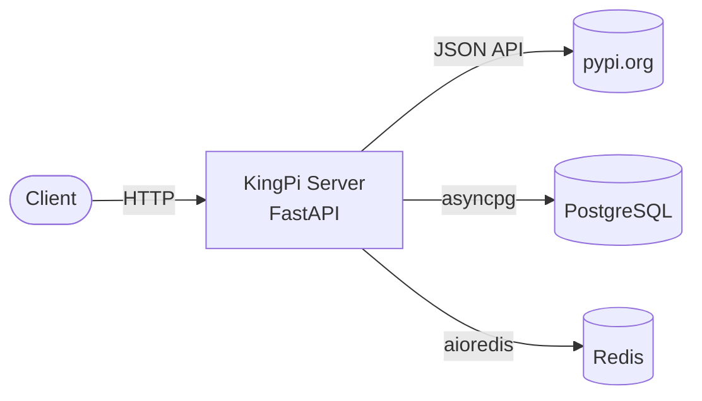
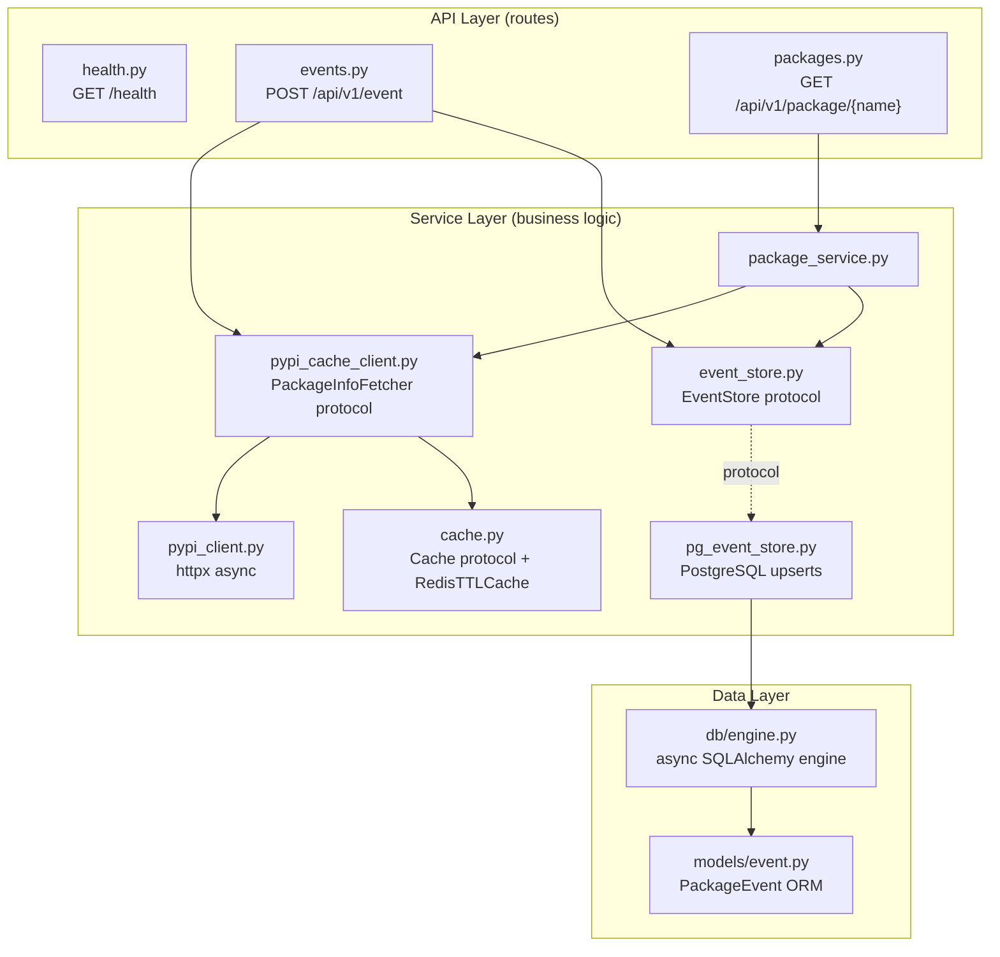
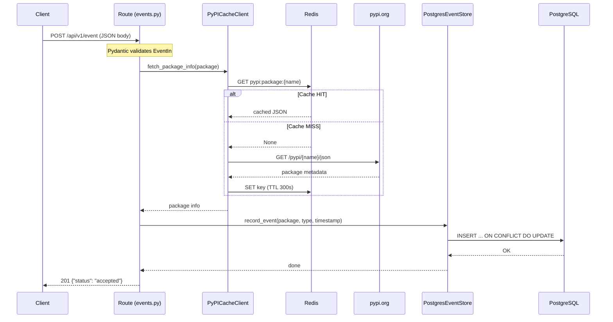
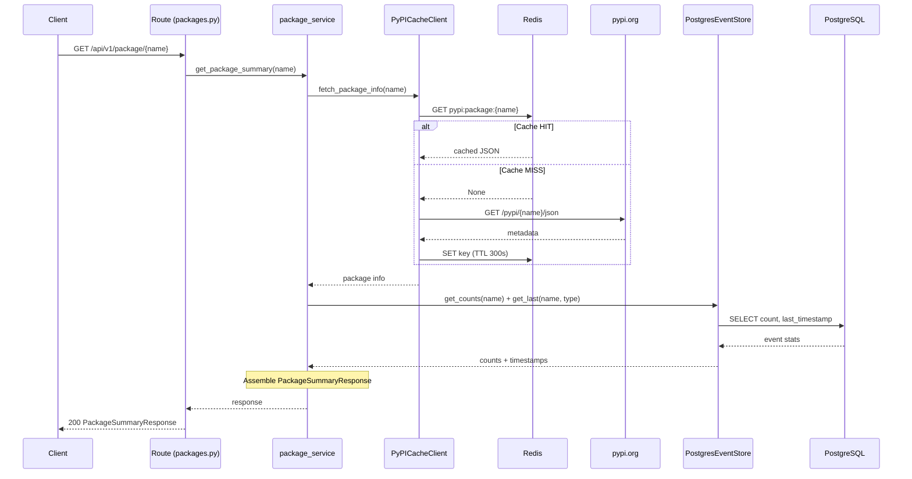
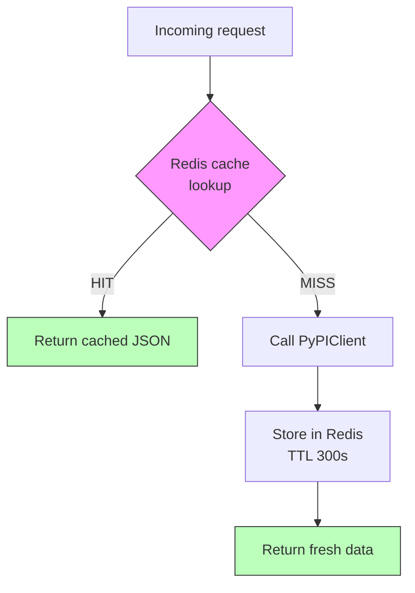
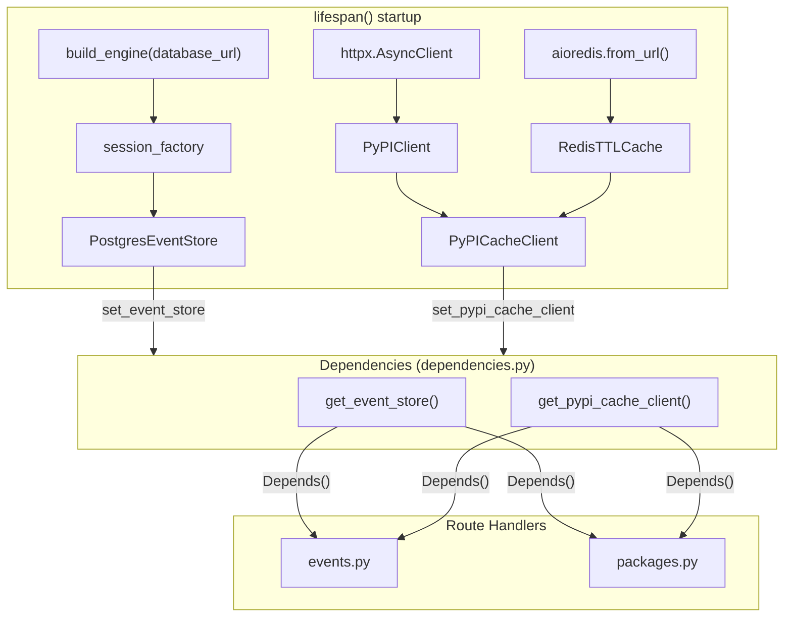

# Architecture

## High-Level System Architecture

## Internal Layer Architecture

## Request Flow: POST /api/v1/event

## Request Flow: GET /api/v1/package/{name}

## Cache-Aside Pattern

## Dependency Injection Wiring

The `lifespan()` context manager in `app.py` wires all dependencies at startup.

